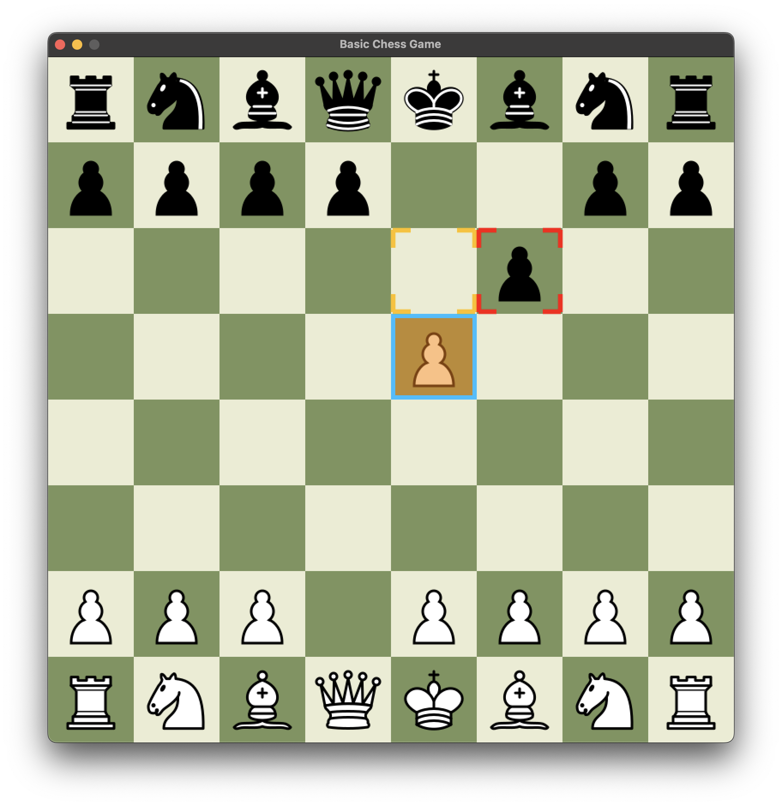

# Love2D Chess

A chess game built in Lua with the [LÖVE](https://love2d.org/) game engine. Originally a learning project, it has grown into a clean, structured implementation of the full chess ruleset.



## Features

- **Full chess rules** — all piece movement with pins respected; no illegal moves possible
- **Check detection** — red king border and CHECK badge when in check, with an audio cue
- **Checkmate & stalemate** — detected automatically; a popup overlays the board without leaving the game screen
- **En passant** and **castling** (kingside and queenside), with correct rights tracking across moves
- **Pawn promotion** — piece-picker popup; the turn switch is deferred until a piece is chosen
- **Resign** — confirmation popup with a cancel option
- **Draggable popups** — all popups can be repositioned by dragging the title bar
- **Move notation** — latest move displayed above the board (e.g. `white_pawn to E4 e.p.`)
- **Timers** — game-elapsed and per-turn timers displayed in the UI
- **Resizable window** — board and UI scale continuously to the current window size
- **Sound effects** — piece moved, piece taken, in-check alert, button click
- **OpenDyslexic font** — used throughout for readability

## Architecture

| File | Responsibility |
|---|---|
| `main.lua` | LÖVE entry point; routes `draw`, mouse input, and screen transitions |
| `chess.lua` | Pure chess logic (no LÖVE dependency); all move generation and validation |
| `theme.lua` | Colour constants and font loading (`Theme.load()`) |
| `layout.lua` | Board and button geometry helpers; `Layout.hit()` for point-in-rect tests |
| `audio.lua` | Sound source registry and playback with random pitch variation |
| `ui.lua` | Draggable popup system (`Popup.show / hide / draw / mousepressed / …`) |
| `popups.lua` | Popup content factories (`gameOver`, `resignConfirm`, `pawnPromotion`) |
| `screens/menu.lua` | Main menu screen |
| `screens/game.lua` | Game screen — board rendering, input handling, game flow |
| `screens/options.lua` | Options screen (stub — currently a placeholder) |
| `spec/chess_spec.lua` | Unit tests, run with `busted spec/` |

## Getting Started

### Prerequisites

- **LÖVE 11+** — [love2d.org](https://love2d.org/)
- **busted** *(optional, for tests)* — `luarocks install busted`

### Run

```bash
git clone https://github.com/yourusername/love2d-chess.git
cd love2d-chess
love .
```

### Tests

```bash
busted spec/
```

## Controls

| Action | Input |
|---|---|
| Select a piece | Left-click a piece belonging to the current player |
| Move | Left-click a highlighted destination square |
| Deselect | Left-click the selected piece again, or click elsewhere |
| Drag a popup | Click and drag the popup title bar |

## Roadmap

### Options screen
- [ ] Populate the Options screen with real settings controls

### Board scenarios
- [ ] Load board positions from data files (FEN or a custom format) to configure puzzles and non-standard starting positions, rather than always beginning from the standard opening

### Timer formatting
- [ ] Format the game and turn timers as `mm:ss` instead of raw decimal seconds

### Move history
- [ ] Record every move in a match as a structured list
- [ ] Display a scrollable move-history panel alongside the board

### Move navigation
- [ ] Undo and redo moves during a game
- [ ] Step through the full move history after the game ends (previous move / next move)

### Configurable themes
- [ ] Define colour palettes and font choices as data, loaded from files
- [ ] Allow players to select a theme from the Options screen

### Options persistence
- [ ] Store settings (selected theme, sound volume, etc.) as data — saved to and loaded from a file between sessions

## Technologies

- **Lua** — lightweight scripting language
- **LÖVE** — 2D game framework

## License

MIT — see [LICENSE](LICENSE).

## Acknowledgements

- **LÖVE** — for the game engine
- **Chess Icons** — [Cburnett](https://commons.wikimedia.org/wiki/User:Cburnett), [CC BY-SA 3.0](https://creativecommons.org/licenses/by-sa/3.0/)
- **Sound Effects** — [Kenney](https://www.kenney.nl), [CC0](http://creativecommons.org/publicdomain/zero/1.0/)
- **OpenDyslexic Font** — [Abbie Gonzalez](https://opendyslexic.org/), [OFL](https://scripts.sil.org/cms/scripts/page.php?site_id=nrsi&id=OFL)
